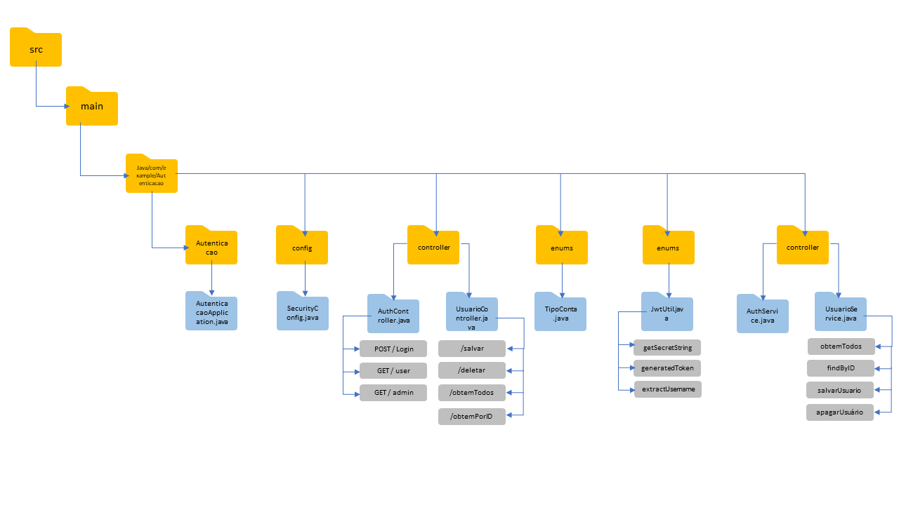
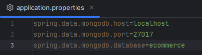
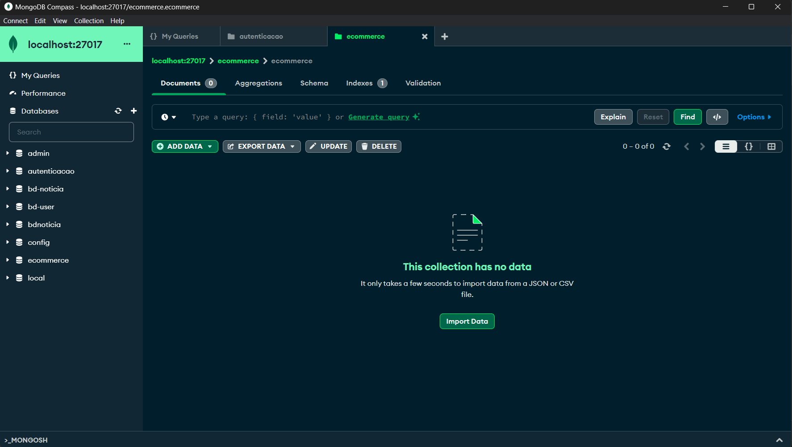

# Autenticação Via Token JWT

## Descrição

- Este projeto tem como finalidade Desenvolver um sistema de autenticação e autorização para uma aplicação de ecommerce, garantindo que apenas usuários autenticados e autorizados tenham acesso
  aos recursos da aplicação. Com base nos token JWT gerados, foram estabelecidas as seguintes premissas: níves de acesso, restrição de acesso e validação do token JWT.

## Estrutura do Projeto

## MongoDB

O projeto está estruturado em diversos pacotes, cada um contendo classes com responsabilidades específicas:

- com.example.Autenticacao: Contém a classe principal da aplicação.
- com.example.config: Configurações de segurança da aplicação.
- com.example.controller: Controladores REST para gerenciamentoe e autenticação dos tipos usuários.
- com.example.entity: Entidades do MongoDB.
- com.example.repository: Interface para interação com MongoDB.
- com.example.security: Utilitários para gerar e validar os tokens JWT.
- com.example.service: Serviços de gerenciamentoe e autenticação de usuários.

## Tecnologias Utilizadas:

- IDE: IntelliJ IDEA
- Spring Boot: Framework de desenvolvimento Java.
- JWT (JSON Web Tokens): Para autenticação/autorização segura.
- MongoDB: Banco de dados para armazenamento de dados.