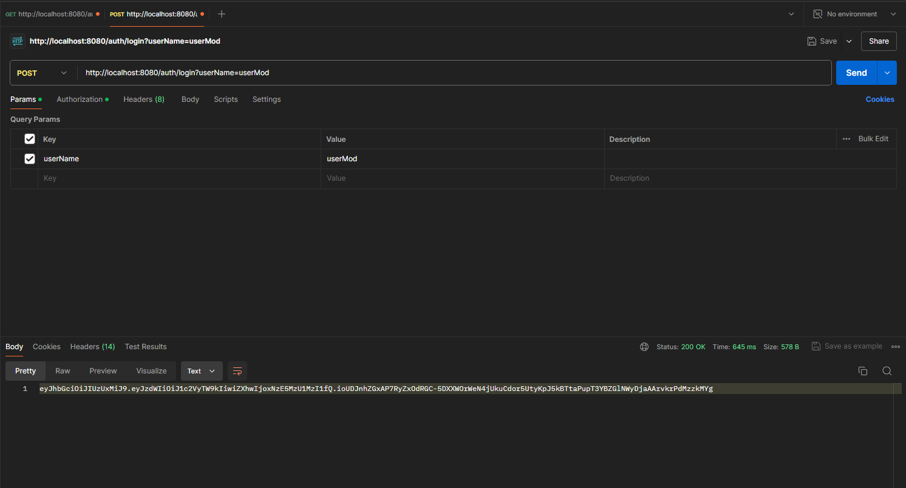
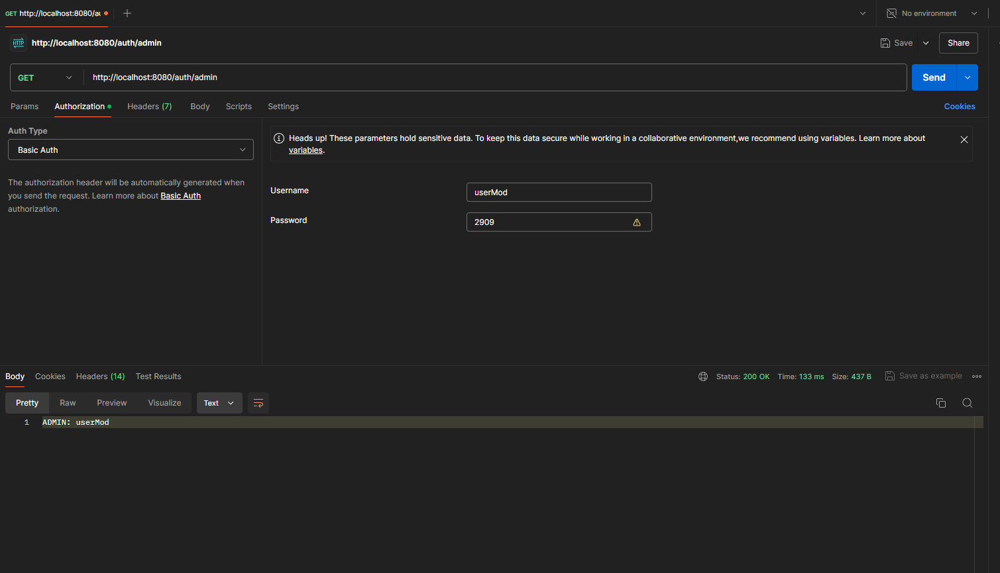
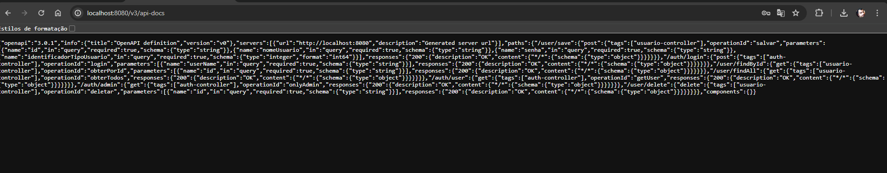
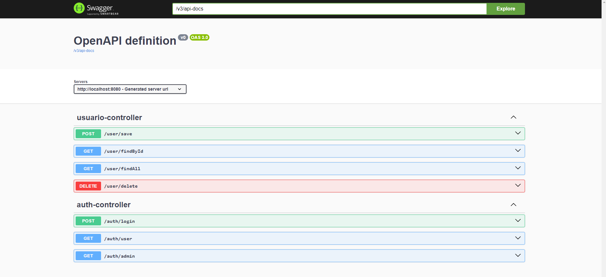

# Autenticação Via Token JWT

## Descrição

- Este projeto tem como finalidade desenvolver um sistema de autenticação seguro para uma plataforma
  online. O objetivo principal é garantir que apenas usuários autenticados tenham acesso aos
  recursos da plataforma. Com base nos token JWT gerados, foram estabelecidas as seguintes premissas: níves de acesso, restrição de acesso e validação do token JWT.

## Evidências

- Gerando token JWT

- Acesso de url por nível de usuário

- OpenAPI

- Spring Doc e o Swagger UI
